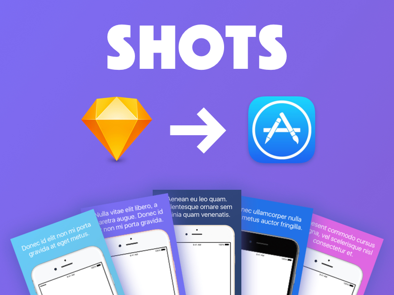
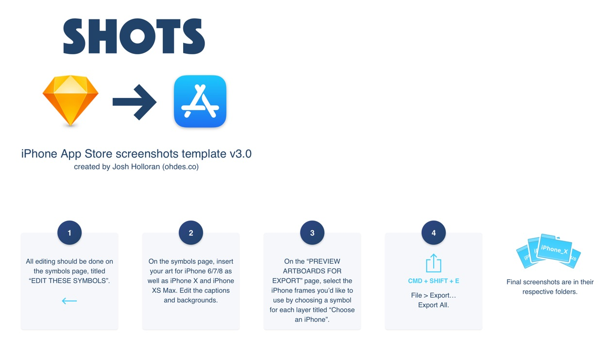
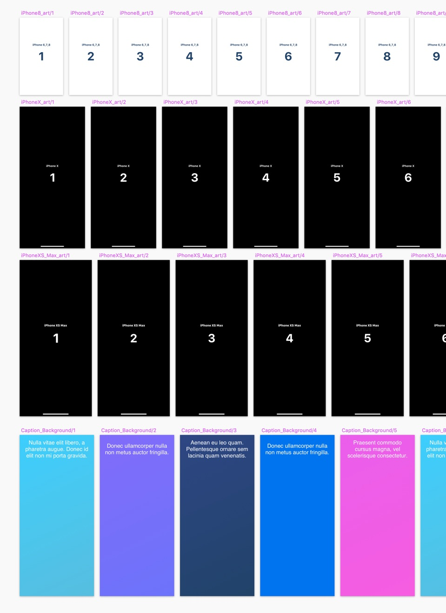
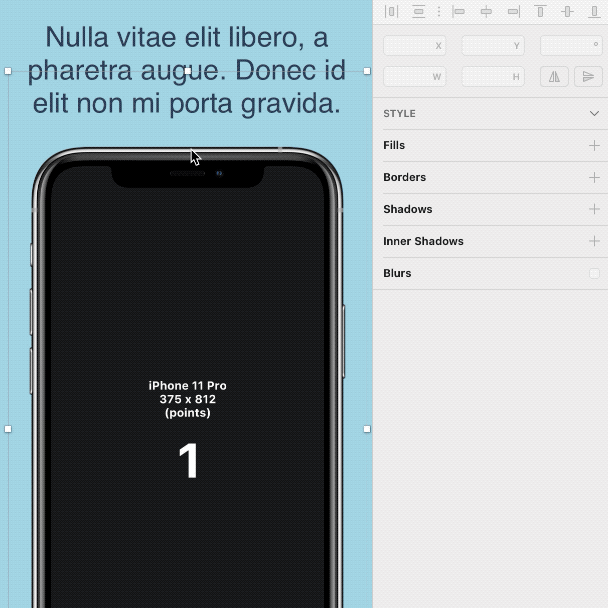
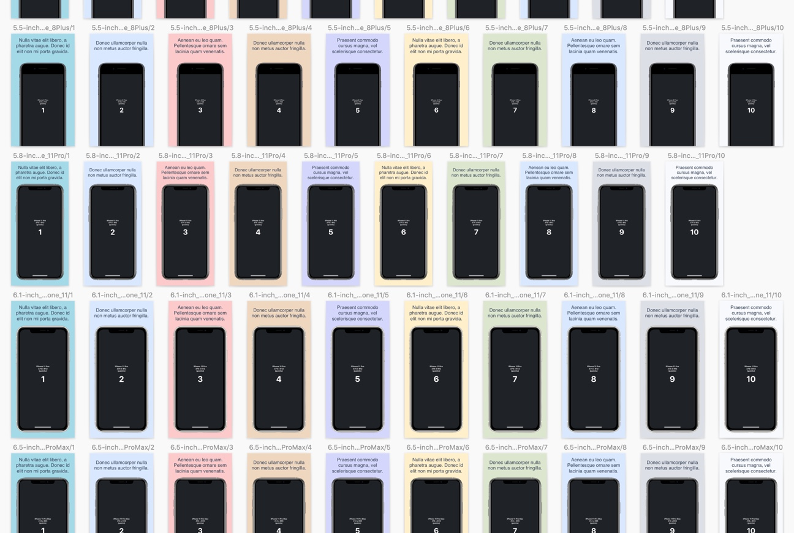

# shots

### Sketch template for generating iPhone App Store screenshots

### Open the Sketch file to view step-by-step instructions.

#### How it Works

Insert ten screenshots of your iPhone app into [Sketch](https://www.sketchapp.com/) symbols at both iPhone 6/7/8 and iPhone XS sizes.

Edit or add to ten additional symbols containing backgrounds and captions.

Choose from a variety of iPhone devices to frame your shots (now including "Clay" options).

Command + Shift + E: Sketch generates all the sizes required by the App Store for iPhone 4, SE, 6/7/8, 6/7/8 Plus, XS, and XR/XS Max.

Enjoy! :facepunch:
